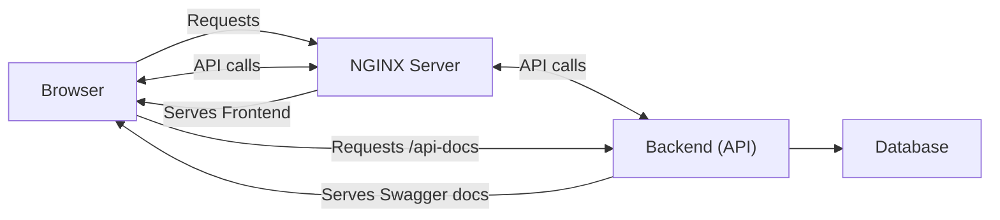

# WAITapp frontend

## Table of contents

- [Overview](#overview)
  - [Project structure](#project-structure)
- [Dependencies](#dependencies)
- [Getting started](#getting-started)

## Overview

This is the frontend for the WAIT application, it is written in `Typescript`, uses `React` and `Vite`. This frontend works together with our backend [`WAITapp-backend`](https://github.com/PatBtw/WAITapp-backend) to deliver the complete functionallity of the application.

### Project structure

The [frontend](https://github.com/PatBtw/WAITapp-frontend) is delivered from a nginx server and the client (browser) that recieves the [frontend](https://github.com/PatBtw/WAITapp-frontend) fetches the [backends](https://github.com/PatBtw/WAITapp-backend) api `REST` to perform `CRUD` operations on the [database](https://github.com/Phillezi/WAITappDB2).



## Dependencies

To work on this application [`bun`](https://bun.sh/) is required, and [`git`](https://git-scm.com/) is used for version control.

| Name                          | Version | Comment             |
| ----------------------------- | ------- | ------------------- |
| [`bun`](https://bun.sh/)      | latest  |                     |
| [`git`](https://git-scm.com/) | latest  | for version control |

## Getting started

To work on this project, make sure you have all the [dependencies](#dependencies) installed.

1. Clone this repository and `cd` into it

```bash
git clone git@github.com:PatBtw/WAITapp-frontend.git
cd WAITapp-frontend
```

2. Install dependencies using `bun`

```bash
bun i
```

3. Setup format on save (optional)

```bash
bun setup
```

4. Start the development server

```bash
bun dev # optionally pass --host to make it available to devices on the network
```

### Additional features

| Command      | Description                                                                   |
| ------------ | ----------------------------------------------------------------------------- |
| bun setup    | Sets up format on save in `vscode` **_NOTE_** _: prettier plugin is required_ |
| bun types    | Generates types (not used yet)                                                |
| bun backend  | Use a local backend `http://localhost:8080`                                   |
| bun frontend | Use the production backend                                                    |
| bun dummy    | Generates and adds dummy users to the currently selected backend              |
